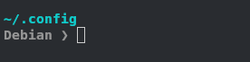
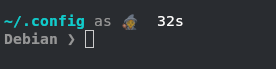

# 🚀 MyStarship-Theme
My personal starship theme

## ✨ Features

- **Monochromatic palette** — white, dimmed white, bright-white; red only for errors
- **Minimal language indicators** — shows only the tool symbol, no version clutter
- **OS name display** — knows where you are at a glance
- **Command duration** — shows how long the last command took
- **Sudo indicator** — subtle `as 🧙` when privileges are elevated
- **Vim mode support** — `❯` / `❮` for insert and normal mode

---

## 📸 Preview





---

## ⚙️ Requirements

- [Starship](https://starship.rs/) >= 1.0

---

## 📦 Installation

### Option 1 — curl (one-liner)

```bash
curl -o ~/.config/starship.toml https://raw.githubusercontent.com/FladioGelo/MyStarship-Theme/main/starship.toml
```

### Option 2 — manual

1. Clone or download this repository
2. Copy `starship.toml` to your Starship config directory:

```bash
cp starship.toml ~/.config/starship.toml
```

3. Restart your terminal or run:

```bash
source ~/.bashrc   # bash
source ~/.zshrc    # zsh
```

---

## 📄 License

MIT — free to use, fork, and customize.
