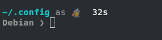
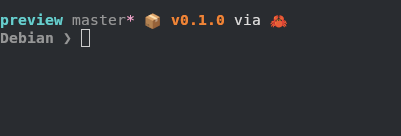

# MyStarship-Theme

## Features

- **OS name display** - cool with grey color
- **Sudo indicator** - `as 🧙`
- **No Runtime Versions mixed with Pure preset style** - based on "no-runtime-versions" and "pure-prompt" presets
- **Never show USERNAME or HOSTNAME** beside the current location

---

## 📸 Preview as sudo



## 📸 Preview in projects


---

## ⚙️ Requirements

- Starship :)

---

## 📦 Installation

### Option 1 — curl (one-liner)

```bash
curl -o ~/.config/starship.toml https://raw.githubusercontent.com/FladioGelo/MyStarship-Theme/main/starship.toml
```

### Option 2 — manual

1. Clone or download this repository
2. Copy `starship.toml` to your Starship config directory:

```bash
cp starship.toml ~/.config/starship.toml
```

---

## 📄 License

MIT — free to use, fork, and customize.
